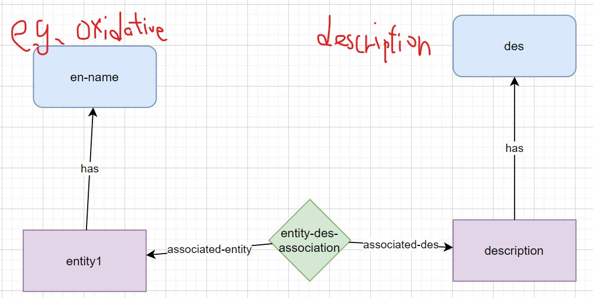
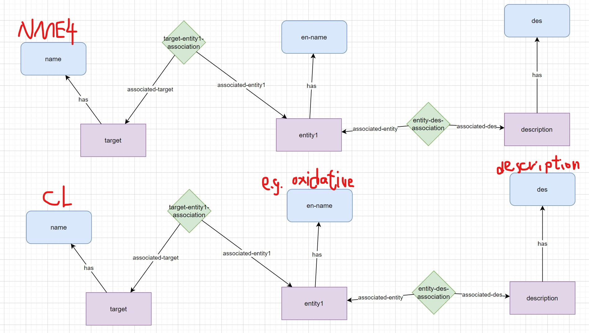

# Proof of concept exercise

## Installation guide
**Prerequesites**: Python >3.6, [TypeDB Core 2.4.0](https://vaticle.com/download#core), [TypeDB Python Client API 2.2.0](https://docs.vaticle.com/docs/client-api/python), [Workbase 2.4.0](https://vaticle.com/download#workbase) (typeDB Studio).

Clone this repo:
```bash 
https://github.com/KinChao/Information-Extrator.git
```
cd into the typedb-all folder and start typedb
```bash 
typedb server
```
cd into the project folder and start the migrator script

```bash
python migrator.py -n 4 # insert using 4 threads
```
If the database already existed, use the following code instead

```bash
python migrator.py -n 4 -f TRUE
```
For help with the migrator script command line options:

```bash
python migrator.py -h
```


Current schema:



Ideal schema:



Make a queey of the tags in TypeDB workbase:
```bash
match
$En isa entity1, has en-name 'oxidative';
$De isa description;
$2 ($En, $De) isa entity-des-association;
get $En, $De, $2;

#change 'oxidative' to other tags like 'peroxidation' to make other queries.
```


